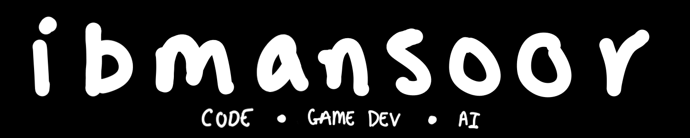

  

## Hello!! 👋👋
My name is Ibrahim. Welcome to my GitHub profile! I like building things related to **games**, **systems**, and **AI**. This page highlights the projects I'm exploring as I grow as a developer.

## Currently Exploring...
- Game development (Godot + game programming and design)
- Low-level and systems programming (C/C++, emulators, memory, graphics programming)
- Applied AI (like computer vision)

	<code></code>
	<code></code>
	<code></code>
	<code></code>
	<code></code>
	<code></code>
	<code></code>

<!--
**ibmansoor/ibmansoor** is a ✨ _special_ ✨ repository because its `README.md` (this file) appears on your GitHub profile.

Here are some ideas to get you started:

- 🔭 I’m currently working on ...
- 🌱 I’m currently learning ...
- 👯 I’m looking to collaborate on ...
- 🤔 I’m looking for help with ...
- 💬 Ask me about ...
- 📫 How to reach me: ...
- 😄 Pronouns: ...
- ⚡ Fun fact: ...
-->
